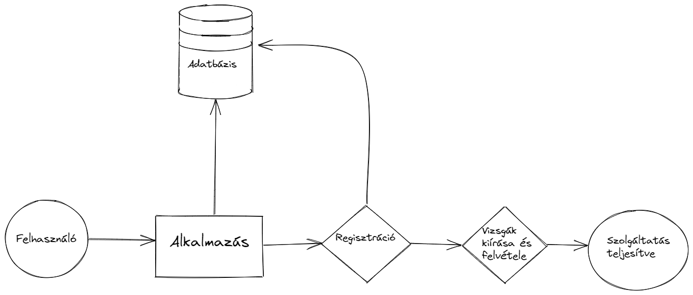

# Rendszerterv

## 1. Bevezetés
A projektünkben egy egyszerűsített modelljét készítjük el a NEPTUN rendszernek egy asztali alkalmazás formájában.
A felhasználók két csoportba lesznek sorolhatók: tanárok és diákok. A tanárok kiírhatnak tantárgyakat, a diákok pedig jelentkezhetnek azokra.

## 2. Projektterv
Az alkalmazásban a tanárok rendelkeznek a legnagyobb jogkörrel, ők tudják kezelni a saját tantárgyaik minden részletét, utánuk következnek a diákok, akik jelentkezni tudnak a tantárgyakra.

## 3. Üzleti folyamatok modellje
### Jelenlegi üzleti folyamatok modellje:
Az alkalmazás a diákok és tanárok feladatait hivatott megkönnyíteni, fókuszban a tantárgyak kiírásával és felvételével. A tantárgyak időponttal és helyszínnel  rendelkeznek, így azokat figyelembe kell venni a használat során

### Igényelt üzleti folyamatok modellje:
Hasonlóan a modellezett Neptun rendszerhez, a profillal rendelkező felhasználók rendelkeznek:
- Neptun kóddal
- jelszóval (amit titkosítunk)
- és szerepkörrel (tanár/diák)

## 4. Funkcionális leírás
A diákok az összes tárgyat látják, de ők csak jelentkezni tudnak azokra, valamint szükség szerint leadni azokat, a tanárok pedig csak a saját tárgyaikat képesek kezelni, de azok minden részletét elérik

## 5. Fizikai környezet
Az alkalmazás Windows operációs rendszeren képes lesz elfutni, mivel egy egyszerűbb Java asztali alkalmazásról van szó. Ebből adódóan nem igényel hatalmas erőforrásokat, egy kétmagos processzor, valamint 2-4GB memóriával (RAM) rendelkező számitógép/laptop képes hiba nélkül futtatni az alkalmazást.

## 6. Követelmények

   * **Funkcionális követelmények:**
       - A felhasználók adatainak eltárolása
       - A tantárgyak adatainak eltárolása
       - A tantárgyak közötti keresés megvalósítása
       - A tantárgyak kiírásának és felvételének kialakítása

   * **Nemfunkcionális követelmények:**
       - A rendszernek egyszerre több felhasználót kell kiszolgálnia
       - Igényes megjelenítés

## 7. Absztrakt domain modellje

## 8. Architektúrális terv
Az architektúrális tervnek a funkcionális követelményeken túl fontos elemét képezik a rendszer használatát befolyásoló tényezők is. Az adatok tárolását adatbázisok segítségével biztosítjuk így rugalmasság szempontjából a későbbi bővítésekre is felkészültünk. Emellett valós időben több felhasználót tud biztonságosan kezelni egyszerre. 
A felhasználók karbantartása is megvalósul. Másik erőssége az alkalmazásnak, hogy az üzemeltetése egyszerű. Az esetleges szerver meghibásodás vagy szolgáltató váltás esetén gond nélkül áttelepíthető másik állomásra. 
A mai korban elengedhetetlen követelmény a biztonság. Ezt a különböző felhasználói jogosultságokkal érhető el. Ennek köszönhetően a látogatók nem tudják a tantárgyak adatait módosítani valamint nem férhetnek hozzá bizalmas információkhoz.

## 9.Implementációs terv
Az elemeket CSS fájlok segítségével dizájnoljuk. A tantárgyak és a felhasználók tárolására szükség van adatbázisra is. A program backend részét Java nyelven valósítjuk meg. A fájlokat külön választjuk, az átláthatóság és az egyszerűbb bővítés érdekében. A felhasználói felületet JavaFX keretrendszerben alakítjuk ki.

## 10.Tesztelési terv
A tesztelés során az alkalmazásban megvalósított funkciók működését figyeljük. A teszteléssel a különböző hibák megtalálása a cél.
 A teszteléseket a unit tesztek segítségével fogjuk elvégezni, valamint utólag
 egy tesztelési dokumentáció is fog készülni amit a csapatunk egyik tagja fog elvégezni és dokumentálni.
 A dokumentum táblázatos formában beküldendő.

 **Tesztelő: Hadobás Dávid TB3376**

 **Tesztelés dátuma: 2022. 05. 20.**

 Tesztszám | Rövid leírás | Várt eredmény | Eredmény | Megjegyzés
 ----------|--------------|---------------|----------|-----------
Teszt #01 | Regisztráció | A felhasználó az adatok megadásával sikeresen regisztrálni tud  | A felhasználó sikeresen regisztrált | Nem találtam problémát.
Teszt #02 | Bejelentkezés | A felhasználó az adatok megadásával sikeresen be tud jelentkezni  | A felhasználó sikeresen bejelentkezett | Nem találtam problémát.
Teszt #03 | Felhasználói felület | A felhasználó az összes implementált funkciót tudja használni a kialakított felület minden részén  | A felhasználó sikeresen elvégezte feladatait | Nem találtam problémát.
 ... | ... | ... | ... | ...
