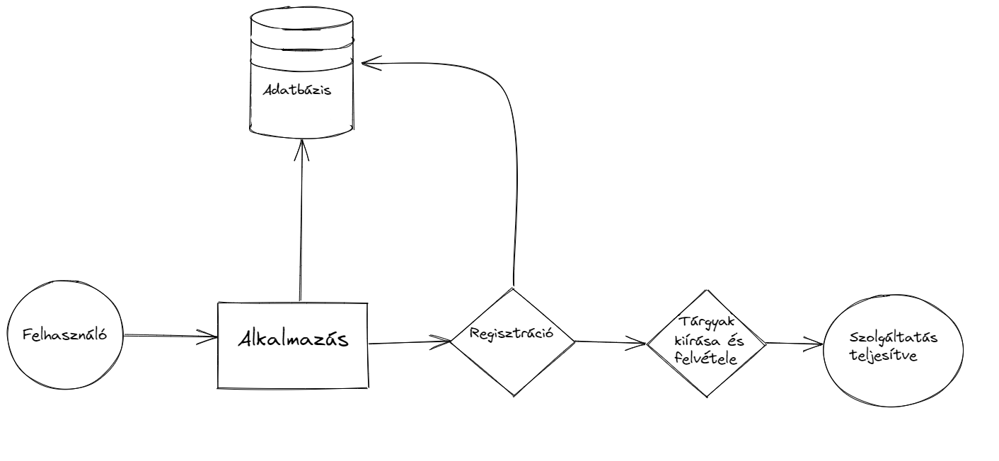

# Rendszerterv

## 1. Bevezetés
A projektünkben egy egyszerűsített modelljét készítjük el a NEPTUN rendszernek egy asztali alkalmazás formájában.
A felhasználók két csoportba lesznek sorolhatók: tanárok és diákok. A tanárok kiírhatnak vizsgákat, a diákok pedig jelentkezhetnek azokra.
A további szükséges moderációs munkákat admin szerepkörben végezhetjük el.

## 2. Projektterv
Az alkalmazásban az adminoknak van a legnagyobb jogköre, ők látják és szerkeszthetik az összes tanár által kiírt vizsgát.
Utánuk következnek a tanárok, akik a kurzusaikhoz tudnak kiírni vizsgákat, valamint a diákok, akik jelentkezni tudnak a vizsgákra.

## 3. Üzleti folyamatok modellje
### Jelenlegi üzleti folyamatok modellje:
Az alkalmazás a diákok és tanárok feladatait hivatott megkönnyíteni, fókuszban a vizsgák kiírásával és felvételével. A vizsgák időponttal, jelentkezési limittel rendelkeznek, így azokat figyelembe kell venni a használat során

### Igényelt üzleti folyamatok modellje:
Hasonlóan a modellezett Neptun rendszerhez, a profillal rendelkező felhasználók rendelkeznek:
- Neptun kóddal
- jelszóval (amit titkosítunk)
- és szerepkörrel (tanár/diák/admin)

## 4. Funkcionális leírás
A vizsgák minden felhasználó számára láthatóak, azonban azok kiírását és módosítását csak a tanárok és adminok, azok felvételét pedig csak a diákok végezhetik.

## 5. Fizikai környezet
Az alkalmazás Windows operációs rendszeren képes lesz elfutni, mivel egy egyszerűbb Java asztali alkalmazásról van szó. Ebből adódóan nem igényel hatalmas erőforrásokat, egy kétmagos processzor, valamint 2-4GB memóriával (RAM) rendelkező számitógép/laptop képes hiba nélkül futtatni az alkalmazást.

## 6. Követelmények

   * **Funkcionális követelmények:**
       - A felhasználók adatainak eltárolása
       - A vizsgák adatainak eltárolása
       - A vizsgák közötti keresés megvalósítása
       - A vizsgák kiírásának és felvételének kialakítása

   * **Nemfunkcionális követelmények:**
       - A rendszernek egyszerre több felhasználót kell kiszolgálnia
       - Igényes megjelenítés

## 7. Absztrakt domain modellje

## 8. Architektúrális terv
Az architektúrális tervnek a funkcionális követelményeken túl fontos elemét képezik a rendszer használatát befolyásoló tényezők is. Az adatok tárolását adatbázisok segítségével biztosítjuk így rugalmasság szempontjából a későbbi bővítésekre is felkészültünk. Emellett valós időben több felhasználót tud biztonságosan kezelni egyszerre. 
A felhasználók karbantartása is megvalósul. Másik erőssége az alkalmazásnak, hogy az üzemeltetése egyszerű. Az esetleges szerver meghibásodás vagy szolgáltató váltás esetén gond nélkül áttelepíthető másik állomásra. 
A mai korban elengedhetetlen követelmény a biztonság. Ezt a különböző felhasználói jogosultságokkal érhető el. Ennek köszönhetően a látogatók nem tudják a vizsgák adatait módosítani valamint nem férhetnek hozzá bizalmas információkhoz.

## 9.Implementációs terv
Az elemeket CSS fájlok segítségével dizájnoljuk. A vizsgák és a felhasználók tárolására szükség van adatbázisra is. A program backend részét Java nyelven valósítjuk meg. A fájlokat külön választjuk, az átláthatóság és az egyszerűbb bővítés érdekében.

## 10.Tesztelési terv
A tesztelés során az alkalmazásban megvalósított funkciók működését figyeljük. A teszteléssel a különböző hibák megtalálása a cél.
 A teszteléseket a unit tesztek segítségével fogjuk elvégezni, valamint utólag
 egy tesztelési dokumentáció is fog készülni amit a csapatunk eggyik tagja fgo elvégezni és dokumentálni.
 A dokumentum táblázatos formában beküldendő.
 A tesztelési dokumentum kitöltésére egy sablon:

 **Tesztelő: Vezetéknév Keresztnév**

 **Tesztelés dátuma: Év.Hónap.Nap**

 Tesztszám | Rövid leírás | Várt eredmény | Eredmény | Megjegyzés
 ----------|--------------|---------------|----------|-----------
 például. Teszt #01 | Regisztráció | A felhasználó az adatok megadásával sikeresen regisztrálni tud  | A felhasználó sikeresen regisztrált | Nem találtam problémát.
 ... | ... | ... | ... | ...
